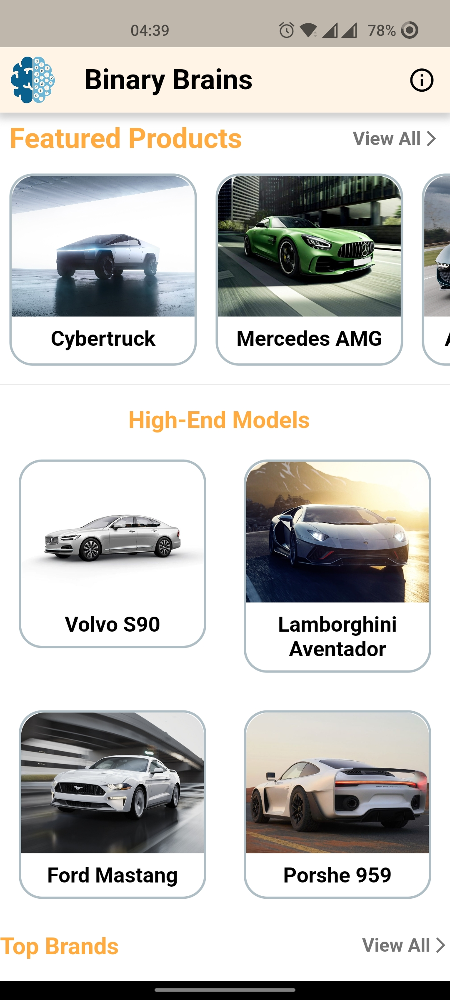
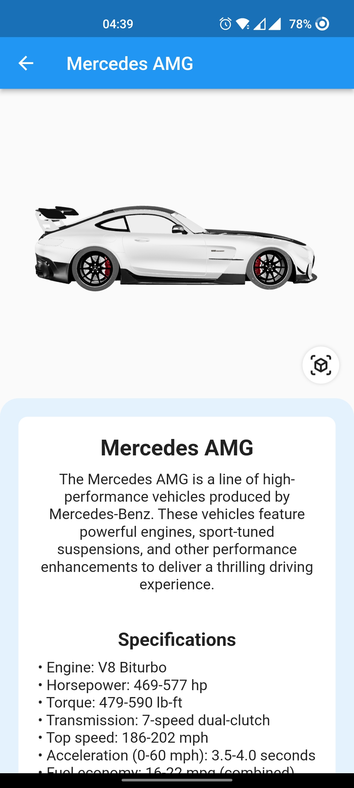
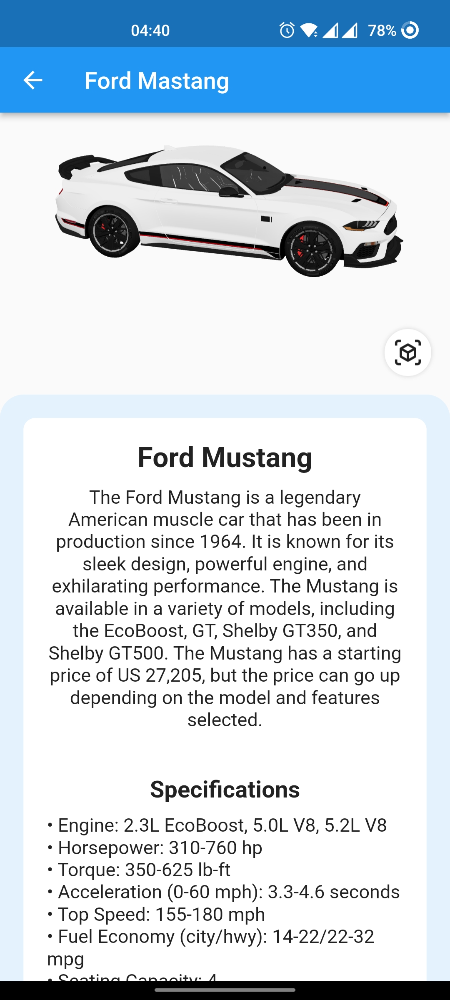
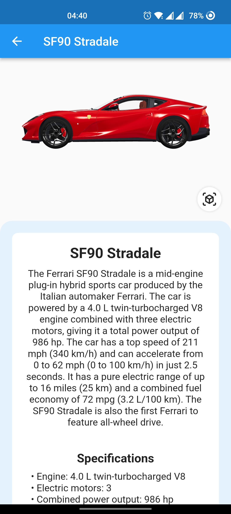

# AR Showroom

## Overview

AR Car Viewer is a mobile application developed using Flutter framework which provides users the ability to view cars in an augmented reality (AR) environment. The app aims to give users a unique car viewing experience, allowing them to visualize cars in a real-world environment using their mobile device camera. It also helps engineers and car designers understand more about the advancement of technology.

## Technology Stack

- Flutter 2.5.3
- ARKit (iOS) and ARCore (Android)
- Blender
- Flutter Packages: camera, image_gallery_saver, ar_flutter_plugin,path_provider,model_viewer_plus

## Installation and Setup

- Clone the repository from GitHub: https://github.com/Churanta/Hackverse-4.0.git
- Open the project in Android Studio or Visual Studio Code
- Install the required packages by running the command flutter pub get
- Connect your mobile device to your computer and enable USB debugging
- Run the app on your mobile device using flutter run

## Declaration of project
We, the development team behind the AR-Based Car Shopping and Visualisation App, hereby declare our commitment to creating a high-quality, innovative, and user-friendly app that will provide an enhanced and engaging car shopping experience for users.

We have built an app to address the inconvenience and lack of engagement that people experience when shopping for cars by providing a more immersive and interactive car shopping experience and by providing detailed information about each car in one place. We are proud to introduce our new app, an Augmented Reality (AR)-based car viewing app developed using the Flutter framework. Our app aims to provide an enhanced and engaging car shopping experience to users by leveraging the benefits of AR technology.

Through our app, users can explore cars in a 3D AR environment, which provides a more immersive and interactive way to visualise different car models. Additionally, our app simplifies the car shopping process by providing detailed information about each car in one place, including both outer and interior details.

Our app differs from others because it uses AR technology to view the app rather than traditional 2D images, which helps attract user attention. It is also highly user-friendly, allowing users to make informed decisions about which car best suits their needs.

Furthermore, our app is the first of its kind, as there are no market competitors that use this technology for displaying different brands and models of vehicles. Our app is also designed to provide a more enjoyable and efficient car shopping experience, making it an ideal choice for users looking for a more engaging way to explore cars.

Our technology stack includes Flutter, Blender, Augmented Reality, and Google AR Core, along with several Flutter packages such as ar_flutter_plugin, path_provider, model_viewer_plus, image_gallery_saver, and camera.

In summary, our app aims to create a more enjoyable and efficient car shopping experience for users by leveraging the benefits of AR technology, providing detailed information about each car in one place, and being highly user-friendly. It is a unique and innovative solution that aids researchers in gaining and learning the most recent car design techniques.

## Screenshots

|          Splash          |        Home Page         |
| :----------------------: | :----------------------: |
|  |  |
|                          |

|       Mercedes AMG       |       Ford Mastang       |       Ferari SF90        |
| :----------------------: | :----------------------: | :----------------------: |
|  |  |  |

## Features

-View cars in an augmented reality environment
-Browse a list of available cars
-View car details, including name, model, price, and specifications
-Rotate and move the car to view it from different angles
-Take a screenshot of the AR view and save it to the gallery
-Share the screenshot with friends and family

## Features

- View cars in an augmented reality environment
- Browse a list of available cars
- View car details, including name, model, price, and specifications
- Rotate and move the car to view it from different angles
- Take a screenshot of the AR view and save it to the gallery
- Share the screenshot with friends and family

## Usage

- Open the app and browse the list of available cars
- Select a car to view in AR
- Use your mobile device camera to scan your surroundings and place the car in the desired location
- Use your fingers to rotate and move the car to view it from different angles
- Take a screenshot of the AR view and save it to the gallery
- Share the screenshot with friends and family

## Code Structure

- 'main.dart' : Endpoint of the app
- 'MainPage.dart' : Home screen with a list of available cars
- 'cars' : AR Screen to view car details

## Contributors

- [Churanta Mondal](https://github.com/Churanta)
- [Gurram Mahananda Reddy](https://github.com/nandu5g2)
- [Darshan Sithan](https://www.linkedin.com/in/darshan-sithan/?lipi=urn%3Ali%3Apage%3Ad_flagship3_people_connections%3B3XpbuuW0TUegNf5MAEYIkQ%3D%3D)

## Future Plans

- Add more cars to the list
- Improve AR accuracy and stability
- Add support for more mobile devices
- Implement car customization features

## Future Plans

- Add more cars to the list
- Improve AR accuracy and stability
- Add support for more mobile devices
- Implement car customization features

## License

This project is licensed under the MIT License - see the LICENSE.md file for details.

## Screenshots
